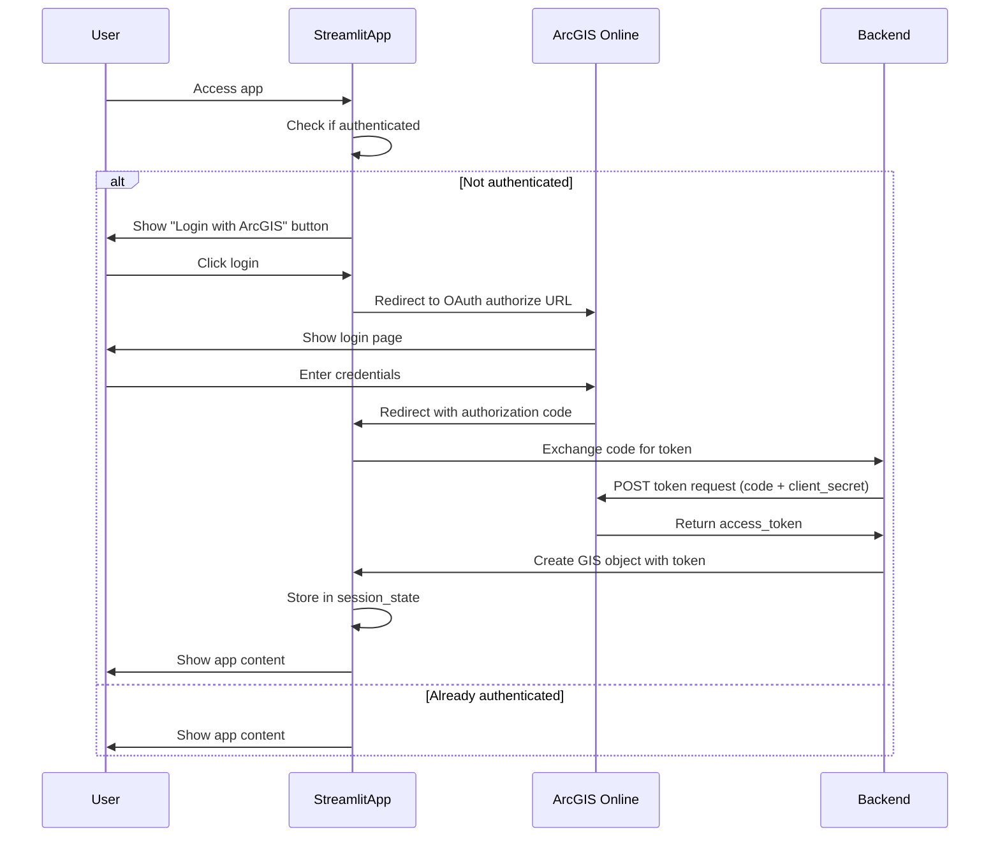

# ArcGIS OAuth User Authentication Implementation

## Overview

Replace username/password authentication with ArcGIS Online OAuth 2.0 authorization code flow. Users will authenticate through AGOL's login page using an OAuth application registered with client_id and client_secret.

## Architecture

The authentication flow will work as follows:

## Implementation Details

### 1. Update Backend Authentication (`backend/utils/auth.py`)

Add OAuth authentication functions:

- `authenticate_oauth_from_env()`: Reads `ARCGIS_CLIENT_ID` and `ARCGIS_CLIENT_SECRET` from environment, builds authorize URL
- `exchange_oauth_code(code, redirect_uri)`: Exchanges authorization code for access token
- `get_gis_from_token(token, portal_url)`: Creates GIS object from access token
- `build_oauth_authorize_url(client_id, redirect_uri, state)`: Constructs OAuth authorize URL

### 2. Update Frontend Authentication (`frontend/page_modules/authentication.py`)

Modify authentication flow:

- Remove username/password form
- Check for OAuth callback via `st.query_params` (Streamlit 1.30+)
- If callback has `code` parameter: exchange for token and authenticate
- If not authenticated: show "Login with ArcGIS" button that redirects to authorize URL
- Show loading spinner during OAuth redirect and token exchange
- Store OAuth state in session_state for CSRF protection

### 3. Environment Variables

Add new required variables:

- `ARCGIS_CLIENT_ID`: OAuth application client ID
- `ARCGIS_CLIENT_SECRET`: OAuth application client secret
- `ARCGIS_REDIRECT_URI`: OAuth redirect URI (e.g., `http://localhost:8501` for local, or production URL)
- `ARCGIS_PORTAL_URL`: Optional, defaults to `https://www.arcgis.com`

Keep existing variables for backward compatibility during transition (optional).

### 4. App Flow Updates (`frontend/app.py`)

Ensure app waits for authentication:

- Current logic already checks `st.session_state.authenticated` before showing content
- No changes needed - authentication module handles the waiting

### 5. Error Handling

- Handle OAuth errors (invalid code, expired code, etc.)
- Show user-friendly error messages
- Log authentication failures for debugging
- Handle missing environment variables gracefully

## Files to Modify

1. `backend/utils/auth.py` - Add OAuth functions
2. `frontend/page_modules/authentication.py` - Replace login form with OAuth flow
3. `README.md` - Update environment variable documentation

## OAuth Application Setup Requirements

Users will need to:

1. Register an OAuth application in ArcGIS Online (Content → My Content → New Item → Developer Credentials → OAuth Credentials)
2. Set redirect URI to match `ARCGIS_REDIRECT_URI` environment variable
3. Configure appropriate privileges/scopes for the application
4. Copy client_id and client_secret to environment variables

## Security Considerations

- Client secret stored in environment variables (not in code)
- OAuth state parameter for CSRF protection
- Tokens stored in session_state (server-side only)
- Redirect URI validation
- Token expiration handling (ArcGIS Python API handles refresh automatically)